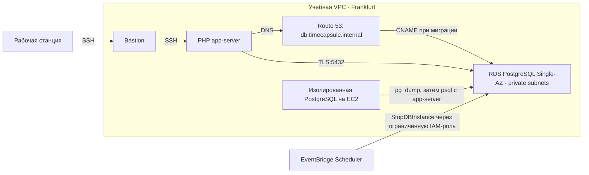

# Архитектура переноса PostgreSQL

```mermaid
flowchart LR
  Dev[Рабочая станция] -->|SSH| Bastion[Bastion]
  subgraph VPC["Учебная VPC · Frankfurt"]
    Bastion -->|SSH| App[PHP app-server]
    App -->|DNS| DNS["Route 53: db.timecapsule.internal"]
    DNS -->|CNAME при миграции| RDS["RDS PostgreSQL Single-AZ · private subnets"]
    App -->|TLS:5432| RDS
    Source["Изолированная PostgreSQL на EC2"] -->|pg_dump, затем psql с app-server| RDS
  end
  Scheduler[EventBridge Scheduler] -->|StopDBInstance через ограниченную IAM-роль| RDS
```

Во время восстановления исходной конфигурации запись CNAME была заменена исходной A-записью на PostgreSQL EC2. Временный RDS удалён.
