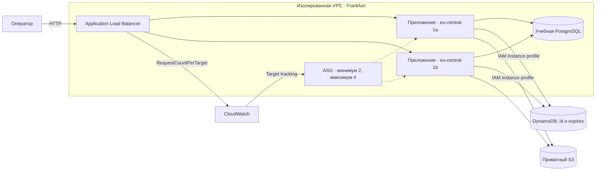

# Архитектура общего хранилища сессий

```mermaid
flowchart LR
  Client[Оператор] -->|HTTP| ALB[Application Load Balancer]
  subgraph VPC["Изолированная VPC · Frankfurt"]
    ALB --> A["Приложение · eu-central-1a"]
    ALB --> B["Приложение · eu-central-1b"]
    ASG["ASG · минимум 2, максимум 4"] -.-> A
    ASG -.-> B
    A --> DB[(Учебная PostgreSQL)]
    B --> DB
  end
  A -->|IAM instance profile| Dynamo[(DynamoDB, id и expires)]
  B -->|IAM instance profile| Dynamo
  A --> S3[(Приватный S3)]
  B --> S3
  ALB -->|RequestCountPerTarget| CW[CloudWatch]
  CW -->|Target tracking| ASG
```

Прогон использовал изолированную PostgreSQL на EC2. Та же DynamoDB-сессия была доступна экземплярам в обеих зонах.
